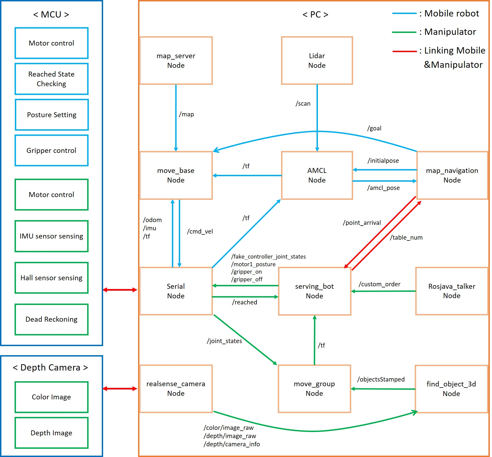
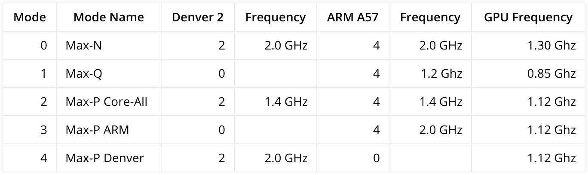

# Servingbot
These are packages for mobile manipulator control.
## Node Communication


## Installation Instructions
### Mobile robot
- #### Install [SLAM and Navigation Package](http://emanual.robotis.com/docs/en/platform/turtlebot3/pc_setup/#install-dependent-ros-packages)
```bash
$ sudo apt-get install ros-kinetic-move-base
$ sudo apt-get install ros-kinetic-gmapping
```
#### If you include the packages about navigation-kinetic-devel, you don't need you install below components
```bash
$ sudo apt-get install ros-kinetic-amcl
$ sudo apt-get install ros-kinetic-rosserial-python
$ sudo apt-get install ros-kinetic-map-server
$ sudo apt-get install ros-kinetic-range-sensor-layer
$ sudo apt-get install ros-kinetic-global-planner
$ sudo apt-get install ros-kinetic-dwa-local-planner
$ sudo apt-get install ros-kinetic-sensor-msgs
```
#### If you have errors about turtlebot3_msgs, download the package.
```bash
$ cd ~/catkin_ws/src
$ git clone https://github.com/ROBOTIS-GIT/turtlebot3_msgs.git
```
### Manipulator
- #### Install [Moveit](https://moveit.ros.org/install/)
```bash
$ sudo apt-get install ros-kinetic-moveit
```
- #### Install [Realsense SDK 2.0](https://github.com/BeomSol/servingbot_ros/tree/master/serving_arm/realsense_ros)
 #### This robot used librealsense v2.10.3 and realsense_ros 2.0.4.

## PC Setting 
### Time synchronization
If this command doesn't work, you will have to fix it manually.
```bash
$ sudo ntpdate -u time.bora.net
```
### Power mode setting for Jetson TX2


```bash
$ sudo nvpmodel -m {mode_num}
```